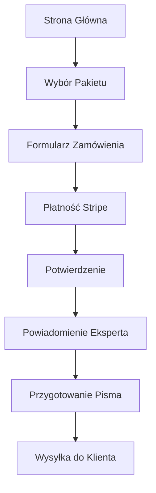

# Dokument Wymagań Produktowych - PismoPRO

## 1. Przegląd Produktu

PismoPRO to platforma online wypełniająca lukę rynkową między drogimi usługami prawnymi a darmowymi szablonami. Dostarczamy szybkie, niedrogie i poprawne merytorycznie pisma urzędowe oraz reklamacyjne.

Nasz model hybrydowy łączy szybkość AI z niezawodnością weryfikacji przez eksperta. Oferujemy usługi taniej i szybciej niż kancelarie, zachowując wysoką jakość, której brakuje darmowym wzorom.

Celem jest stworzenie wiodącej platformy w Polsce dla generowania pism prawnych, obsługującej rynek o wartości setek milionów złotych rocznie.

## 2. Główne Funkcjonalności

### 2.1 Role Użytkowników

| Rola | Metoda Rejestracji | Główne Uprawnienia |
|------|-------------------|--------------------|
| Klient | Formularz zamówienia | Może składać zamówienia, wypełniać formularze, dokonywać płatności |
| Ekspert | Dostęp wewnętrzny | Otrzymuje powiadomienia o nowych zleceniach, weryfikuje i przygotowuje pisma |
| Administrator | Dostęp systemowy | Zarządza zamówieniami, monitoruje płatności, konfiguruje system |

### 2.2 Moduły Funkcjonalne

Nasza platforma składa się z następujących głównych stron:

1. **Strona główna**: sekcja hero, nawigacja, cennik, FAQ
2. **Modal zamówienia**: formularz danych klienta, wybór typu sprawy, opis problemu
3. **System płatności**: integracja Stripe, obsługa BLIK i kart płatniczych
4. **Panel eksperta**: powiadomienia o nowych zleceniach, zarządzanie statusami

### 2.3 Szczegóły Stron

| Nazwa Strony | Nazwa Modułu | Opis Funkcjonalności |
|--------------|--------------|----------------------|
| Strona główna | Sekcja Hero | Wyświetla główną propozycję wartości, przyciski CTA do zamówienia |
| Strona główna | Jak to działa | Prezentuje 3-etapowy proces: opis sprawy → płatność → przygotowanie pisma |
| Strona główna | Cennik | Wyświetla 3 pakiety: Express (59 zł), Premium (199 zł), Dla Firm (690 zł/mc) |
| Strona główna | Sekcja Naszeauto | Specjalna oferta dla spraw pojazdowych (99 zł) |
| Strona główna | FAQ | Odpowiedzi na najczęstsze pytania klientów |
| Modal zamówienia | Formularz klienta | Zbiera dane: imię, email, typ sprawy, opis problemu |
| Modal zamówienia | System płatności | Integracja Stripe Elements, obsługa płatności BLIK/karty |
| Modal zamówienia | Potwierdzenie | Wyświetla status płatności i następne kroki |

## 3. Główny Proces

**Przepływ Klienta:**
1. Klient odwiedza stronę główną i wybiera odpowiedni pakiet
2. Wypełnia formularz z danymi osobowymi i opisem sprawy
3. System zapisuje zamówienie w Firestore ze statusem "pending_payment"
4. Cloud Function automatycznie tworzy intencję płatności w Stripe
5. Klient dokonuje płatności przez bezpieczny formularz Stripe
6. Po udanej płatności ekspert otrzymuje powiadomienie email
7. Ekspert weryfikuje sprawę i przygotowuje pismo
8. Gotowy dokument jest wysyłany do klienta

**Przepływ Eksperta:**
1. Otrzymuje powiadomienie email o nowym, opłaconym zleceniu
2. Analizuje dane klienta i opis sprawy
3. Przygotowuje spersonalizowane pismo
4. W pakiecie Premium - kontaktuje się z drugą stroną
5. Wysyła gotowy dokument do klienta

## 4. Projekt Interfejsu Użytkownika

### 4.1 Styl Projektowy

- **Kolory główne**: Ciemny motyw z #0D1117 (tło), #58A6FF (akcent niebieski), #3FB950 (akcent zielony)
- **Styl przycisków**: Zaokrąglone (8px), z efektami hover i cieniami
- **Czcionki**: Inter, rozmiary 14px-60px w zależności od elementu
- **Styl układu**: Oparte na kartach, nawigacja górna, responsywny design
- **Ikony**: SVG w stylu outline, kolory zgodne z paletą

### 4.2 Przegląd Projektów Stron

| Nazwa Strony | Nazwa Modułu | Elementy UI |
|--------------|--------------|-------------|
| Strona główna | Sekcja Hero | Gradient text, duże przyciski CTA, animacje hover |
| Strona główna | Cennik | Karty z efektami hover, wyróżniony pakiet Premium |
| Modal zamówienia | Formularz | Ciemne inputy z niebieskimi obramowaniami focus |
| Modal zamówienia | Płatność | Stripe Elements w ciemnym motywie |

### 4.3 Responsywność

Platforma jest zaprojektowana jako desktop-first z pełną adaptacją mobilną. Wszystkie elementy są zoptymalizowane pod kątem interakcji dotykowych na urządzeniach mobilnych.