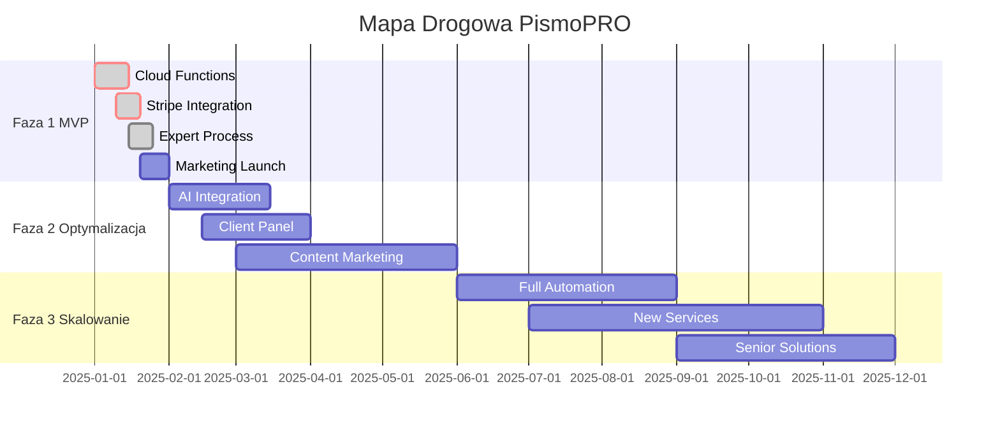

# Mapa Drogowa Rozwoju - PismoPRO

## Przegląd Strategiczny

PismoPRO rozwija się w trzech kluczowych fazach, od MVP po pełną automatyzację i ekspansję rynkową. Każda faza ma jasno określone cele biznesowe i techniczne.

## Faza 1: MVP i Walidacja Rynku (0-1 miesiąc)

### Cel Biznesowy

Szybkie uruchomienie produktu i pozyskanie pierwszych 50-100 klientów do walidacji product-market fit.

### Zadania Techniczne

#### 1.1 Finalizacja Backend (Priorytet: KRYTYCZNY)

* **Cloud Function dla płatności**

  * Implementacja funkcji `createPaymentIntent`

  * Obsługa webhook Stripe dla potwierdzenia płatności

  * Aktualizacja statusu zamówienia w Firestore

  * Wysyłanie powiadomień email do eksperta

* **Konfiguracja Stripe**

  * Aktywacja konta produkcyjnego

  * Konfiguracja webhook endpoints

  * Testowanie płatności BLIK i kartami

#### 1.2 Proces Eksperta

* **System powiadomień**

  * Email template dla nowych zleceń

  * Integracja z Gmail/Outlook

  * Dashboard do przeglądania zamówień

#### 1.3 Marketing i Uruchomienie

* **Google Ads**

  * Kampanie na frazy: "pismo do urzędu", "reklamacja online", "wezwanie do zapłaty"

  * Landing page optimization

  * Tracking konwersji

### Metryki Sukcesu Fazy 1

* 50+ zamówień w pierwszym miesiącu

* Conversion rate > 2% z ruchu organicznego

* Średni czas realizacji zamówienia < 24h

* Customer satisfaction > 4.5/5

### Budżet Fazy 1

* Google Ads: 5,000 zł

* Stripe fees: \~3% z obrotów

* Firebase: \~200 zł/miesiąc

## Faza 2: Optymalizacja i Automatyzacja (2-6 miesięcy)

### Cel Biznesowy

Zwiększenie efektywności operacyjnej, budowanie marki i osiągnięcie 500+ zamówień miesięcznie.

### Zadania Techniczne

#### 2.1 Integracja AI (Gemini)

* **Panel Eksperta z AI**

  * Interfejs do generowania draft'ów pism

  * Integracja z Gemini API

  * Template system dla różnych typów spraw

  * Edytor WYSIWYG dla finalizacji dokumentów

* **Automatyzacja Draft'ów**

  * AI analizuje opis sprawy klienta

  * Generuje wstępną wersję pisma

  * Ekspert weryfikuje i dopracowuje

  * Skrócenie czasu realizacji do 2-4h

#### 2.2 Panel Klienta

* **Firebase Authentication**

  * Rejestracja/logowanie klientów

  * Panel śledzenia statusu zamówień

  * Historia zamówień

  * Możliwość pobrania gotowych dokumentów

* **Komunikacja z klientem**

  * System wiadomości w panelu

  * Email notifications o statusie

  * SMS notifications (opcjonalnie)

#### 2.3 Content Marketing

* **Blog System**

  * CMS dla artykułów prawnych

  * SEO optimization

  * Kategorie: reklamacje, sprawy urzędowe, porady prawne

  * Target: 50+ artykułów w 6 miesięcy

### Metryki Sukcesu Fazy 2

* 500+ zamówień miesięcznie

* Średni czas realizacji < 4h

* 30% klientów powracających

* Ruch organiczny > 10,000 sesji/miesiąc

* Customer Lifetime Value > 300 zł

### Budżet Fazy 2

* Gemini API: \~1,000 zł/miesiąc

* Marketing content: 8,000 zł

* Firebase/hosting: \~500 zł/miesiąc

* Dodatkowy ekspert: 15,000 zł/miesiąc

## Faza 3: Skalowanie i Ekspansja (6-18 miesięcy)

### Cel Biznesowy

Ugruntowanie pozycji lidera w niszy, ekspansja na nowe segmenty i osiągnięcie 2,000+ zamówień miesięcznie.

### Zadania Techniczne

#### 3.1 Pełna Automatyzacja

* **AI-First Approach**

  * Automatyczne generowanie draft'ów po płatności

  * Machine learning na bazie historycznych pism

  * Personalizacja na podstawie typu sprawy

  * Ekspert tylko weryfikuje i wysyła

* **Advanced Analytics**

  * Dashboard biznesowy

  * Predykcja sukcesu sprawy

  * A/B testing platform

  * Customer segmentation

#### 3.2 Nowe Usługi

* **Rozszerzona Oferta**

  * Proste umowy (najmu, zlecenia)

  * Pisma korporacyjne

  * Konsultacje prawne online

  * Pakiety dla większych firm

* **API dla Partnerów**

  * White-label rozwiązania

  * Integracja z platformami e-commerce

  * API dla biur rachunkowych

#### 3.3 Rozwiązania dla Seniorów

* **Uproszczony Interfejs**

  * Większe czcionki i przyciski

  * Prostszy formularz

  * Wsparcie głosowe

  * Tutorial video

* **Wsparcie Telefoniczne**

  * Infolinia dla seniorów

  * Wypełnianie formularza przez telefon

  * Płatność za pobraniem (opcjonalnie)

### Metryki Sukcesu Fazy 3

* 2,000+ zamówień miesięcznie

* 5+ nowych typów usług

* Ekspansja na 3+ nowe segmenty

* Średni czas realizacji < 1h

* Net Promoter Score > 70

### Budżet Fazy 3

* R\&D (AI/ML): 25,000 zł/miesiąc

* Marketing expansion: 30,000 zł/miesiąc

* Zespół (5+ osób): 80,000 zł/miesiąc

* Infrastruktura: 2,000 zł/miesiąc

## Timeline i Kamienie Milowe

## Analiza Ryzyk i Mitygacja

### Ryzyko Techniczne

* **Problem**: Awaria Firebase/Stripe

* **Mitygacja**: Backup systemy, monitoring 24/7

### Ryzyko Biznesowe

* **Problem**: Niska konwersja

* **Mitygacja**: A/B testing, optymalizacja UX

### Ryzyko Prawne

* **Problem**: Zmiany w przepisach

* **Mitygacja**: Stały monitoring legislacji, elastyczne szablony

### Ryzyko Konkurencyjne

* **Problem**: Wejście dużych graczy

* **Mitygacja**: Szybkie skalowanie, budowanie moat przez AI

## Kluczowe Wskaźniki Wydajności (KPI)

### Metryki Biznesowe

* Monthly Recurring Revenue (MRR)

* Customer Acquisition Cost (CAC)

* Customer Lifetime Value (CLV)

* Churn Rate

* Net Promoter Score (NPS)

### Metryki Techniczne

* System Uptime (target: 99.9%)

* Average Response Time

* Error Rate

* Conversion Funnel Metrics

### Metryki Operacyjne

* Średni czas realizacji zamówienia

* Satisfaction Score eksperta

* Liczba błędów w pismach

* Skuteczność pism (% pozytywnych rozstrzygnięć)

## Następne Kroki

### Natychmiastowe (1-2 tygodnie)

1. Implementacja Cloud Function dla Stripe
2. Konfiguracja webhook'ów
3. Testowanie pełnego flow płatności
4. Przygotowanie procesu dla eksperta

### Krótkoterminowe (1 miesiąc)

1. Uruchomienie kampanii Google Ads
2. Monitoring pierwszych zamówień
3. Optymalizacja na podstawie feedbacku
4. Przygotowanie do Fazy 2

### Długoterminowe (3-6 miesięcy)

1. Rozwój AI capabilities
2. Budowanie zespołu
3. Ekspansja marketingowa
4. Przygotowanie do skalowania

