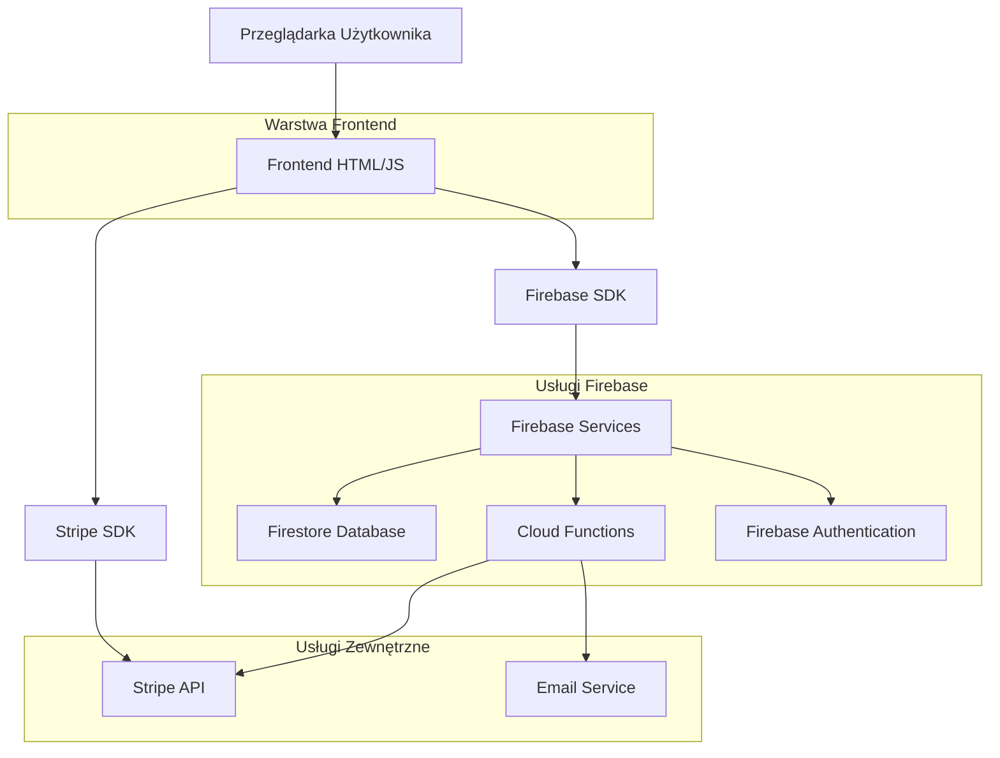
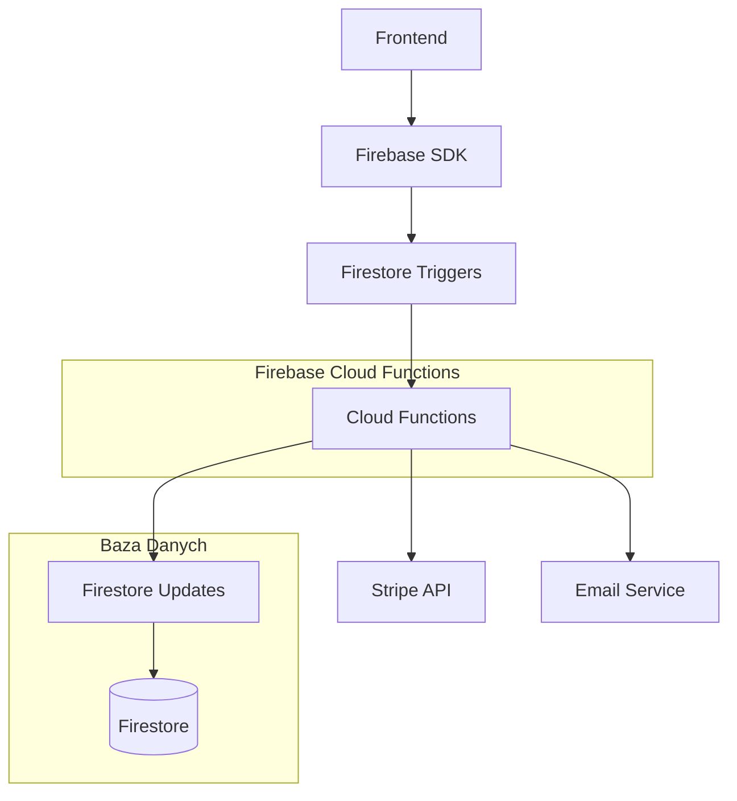
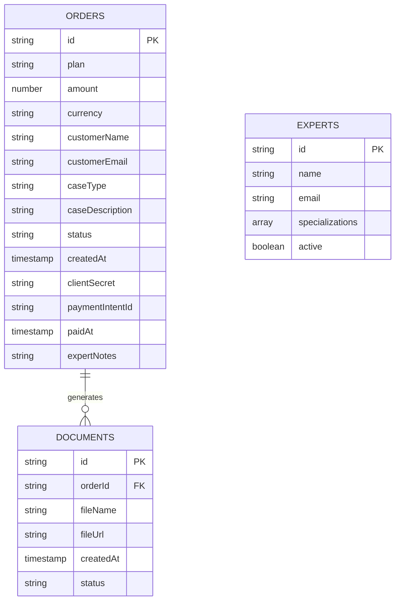

# Dokument Architektury Technicznej - PismoPRO

## 1. Projekt Architektury



## 2. Opis Technologii

* **Frontend**: HTML5 + Tailwind CSS + Vanilla JavaScript + Firebase SDK

* **Backend**: Firebase Cloud Functions (Node.js)

* **Baza danych**: Firestore (NoSQL)

* **Płatności**: Stripe API

* **Hosting**: Firebase Hosting (lub Vercel)

## 3. Definicje Tras

| Trasa                     | Cel                                                |
| ------------------------- | -------------------------------------------------- |
| /                         | Strona główna z cennikiem i formularzem zamówienia |
| /?payment\_status=success | Przekierowanie po udanej płatności                 |
| #jak-to-dziala            | Sekcja wyjaśniająca proces                         |
| #cennik                   | Sekcja z pakietami usług                           |
| #naszeauto                | Specjalna oferta dla spraw pojazdowych             |
| #faq                      | Często zadawane pytania                            |

## 4. Definicje API

### 4.1 Core API

**Cloud Function - Tworzenie płatności**

```
Trigger: Firestore onCreate /orders/{orderId}
```

Parametry wejściowe (dokument Firestore):

| Nazwa Parametru | Typ    | Wymagany | Opis                    |
| --------------- | ------ | -------- | ----------------------- |
| plan            | string | true     | Nazwa wybranego pakietu |
| amount          | number | true     | Kwota w groszach        |
| currency        | string | true     | Waluta (zawsze 'pln')   |
| customerName    | string | true     | Imię i nazwisko klienta |
| customerEmail   | string | true     | Adres email klienta     |
| caseType        | string | true     | Typ sprawy              |
| caseDescription | string | true     | Opis sprawy             |
| status          | string | true     | Status zamówienia       |

Parametry wyjściowe (aktualizacja dokumentu):

| Nazwa Parametru | Typ    | Opis                           |
| --------------- | ------ | ------------------------------ |
| clientSecret    | string | Klucz do finalizacji płatności |
| paymentIntentId | string | ID intencji płatności w Stripe |

Przykład dokumentu zamówienia:

```json
{
  "plan": "Premium",
  "amount": 19900,
  "currency": "pln",
  "customerName": "Jan Kowalski",
  "customerEmail": "jan@example.com",
  "caseType": "Reklamacja",
  "caseDescription": "Wadliwy produkt...",
  "status": "pending_payment",
  "createdAt": "2025-01-01T10:00:00Z",
  "clientSecret": "pi_xxx_secret_xxx",
  "paymentIntentId": "pi_xxx"
}
```

**Webhook Stripe - Potwierdzenie płatności**

```
POST /stripe-webhook
```

Parametry wejściowe:

| Nazwa Parametru | Typ    | Wymagany | Opis                                   |
| --------------- | ------ | -------- | -------------------------------------- |
| type            | string | true     | Typ eventu (payment\_intent.succeeded) |
| data.object     | object | true     | Obiekt PaymentIntent                   |

Parametry wyjściowe:

| Nazwa Parametru | Typ    | Opis                              |
| --------------- | ------ | --------------------------------- |
| status          | string | Status odpowiedzi (success/error) |

## 5. Architektura Serwera



## 6. Model Danych

### 6.1 Definicja Modelu Danych



### 6.2 Język Definicji Danych

**Kolekcja Orders (zamówienia)**

```javascript
// Struktura dokumentu w Firestore
const orderSchema = {
  id: 'auto-generated',
  plan: 'Express | Premium | Dla Firm (Subskrypcja)',
  amount: 5900, // kwota w groszach (Express: 5900, Premium: 19900, Dla Firm: 69000)
  currency: 'pln',
  customerName: 'string',
  customerEmail: 'string',
  caseType: 'string',
  caseDescription: 'string',
  status: 'pending_payment | paid | in_progress | completed | cancelled',
  createdAt: 'timestamp',
  clientSecret: 'string', // dodawane przez Cloud Function
  paymentIntentId: 'string', // dodawane przez Cloud Function
  paidAt: 'timestamp', // dodawane po płatności
  expertNotes: 'string' // notatki eksperta
};

// Indeksy
// Automatyczne indeksowanie przez Firestore na podstawie zapytań
// Composite index: status + createdAt (desc)
// Single field index: customerEmail
```

**Kolekcja Experts (eksperci)**

```javascript
const expertSchema = {
  id: 'auto-generated',
  name: 'string',
  email: 'string',
  specializations: ['reklamacje', 'sprawy_urzedowe', 'pojazdy'],
  active: true,
  createdAt: 'timestamp'
};
```

**Kolekcja Documents (dokumenty)**

```javascript
const documentSchema = {
  id: 'auto-generated',
  orderId: 'string', // referencja do zamówienia
  fileName: 'string',
  fileUrl: 'string', // URL do Firebase Storage
  createdAt: 'timestamp',
  status: 'draft | final | sent'
};
```

**Reguły bezpieczeństwa Firestore**

```javascript
rules_version = '2';
service cloud.firestore {
  match /databases/{database}/documents {
    // Orders - tylko odczyt dla właściciela
    match /orders/{orderId} {
      allow read: if request.auth != null && 
                     resource.data.customerEmail == request.auth.token.email;
      allow create: if request.auth == null; // dla niezalogowanych klientów
    }
    
    // Experts - tylko dla zalogowanych ekspertów
    match /experts/{expertId} {
      allow read, write: if request.auth != null && 
                           request.auth.token.email in ['expert@pismopro.pl'];
    }
    
    // Documents - tylko dla właściciela zamówienia
    match /documents/{documentId} {
      allow read: if request.auth != null;
    }
  }
}
```

**Przykładowe dane inicjalne**

```javascript
// Ekspert
db.collection('experts').add({
  name: 'Jan Prawnik',
  email: 'expert@pismopro.pl',
  specializations: ['reklamacje', 'sprawy_urzedowe', 'pojazdy'],
  active: true,
  createdAt: new Date()
});

// Przykładowe zamówienie
db.collection('orders').add({
  plan: 'Premium',
  amount: 19900,
  currency: 'pln',
  customerName: 'Anna Kowalska',
  customerEmail: 'anna@example.com',
  caseType: 'Reklamacja (np. produktu, usługi)',
  caseDescription: 'Zakupiłam wadliwy telefon, który przestał działać po tygodniu...',
  status: 'pending_payment',
  createdAt: new Date()
});
```

